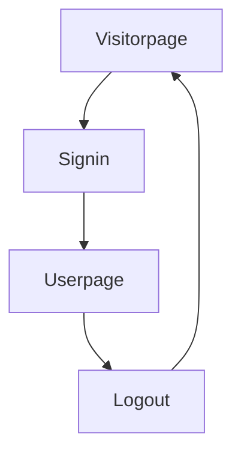
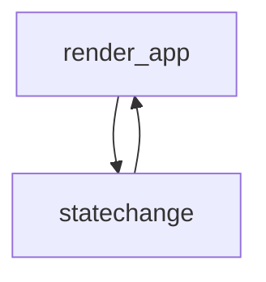

# Day 1
## created react project
* `npx create-react-app bulletinboard`
* `cd bulletinboard`
* Install dependencies\
`npm install react-bootstrap bootstrap`\
`npm install react-router-dom`
* `npm start`

***

# Day 2
## added navigation component and pages
* import bootstrap library in app.js or index.js file
* make components folder
* create navigation.js file
* create navbar using react-bootstrap
* export navbar component and import it in app.js file
* create files for home page, signin page, signup page, todaysposts page.
* import BrowserRouter in index.js 
* _react-router-dom is used for client side navigation.it prevents the default behaviour of the browser to send request to the server and navigates from client side.advantages of client side navigation are reduces network traffic, preserves the state of application, ensures smooth execution or usage_
* `import {Routes, Route} from 'react-router-dom'`
* _Routes contain the route elements which further specify the url and corresponsing component whihc has to be rendered upon visiting the url._
## Lazy loading
_In a single page application,the client loads the whole application at once and later navigates through it without sending request to the server. But it might happen that the single page application might contain some mostly used(default) components and rarely visited components. Loading the whole application at a time might increase the load time and network bandwidth too. To avoid this, we use lazy loading. Through this, the client loads only the default components intially and sends a server request once for the rarely visited components i.e., the first time they are visited._
### _Advantages_
* _reduces initial loading time._
* _reduce initial network bandwidth._
### Suspense component
Suspense component is wrapped around <Route> component with a fallback attribute that contains the component to be rendered in case of low network bandwidth until the actual component is rendered.\
```javascript
    import { Spinner } from "react-bootstrap";
    const Loading = () => {
    return (<Spinner animation="border" variant="primary" />);
    }
    export default Loading;
    <Suspense fallback={<Loading />}
```

# Day 3
## Objective
* creating signin and logout component.
* creating separate pages for user and visitor.
* Flow (visitor page on opening -> signin -> user page -> logout -> visitor)
* adding httpcookie to store login activity of the user to remember the user and avoid multiple signins'.
## app flow


 
## Cookie addition
   purpose - avoid multiple signin for a single user in the same browser.
   code -
    
```javascript
    const [loggedIn,setLoggedIn] = useState(0);
    const SigninHandler = (event) => {
    event.preventDefault();
    localStorage.setItem('logged','1');
    setLoggedIn(1);
    } 
    const Onsignout = () => {
    localStorage.setItem('logged','0');
    setLoggedIn(0);
    }
    useEffect(()=>{
    if (localStorage.getItem("logged") === "1") {
      setLoggedIn(1);
    } 
    });
```
### useEffect Hook react
* purpose - code block in useEffect gets executed when a page is loaded/refreshed/change in the value of dependencies
* Syntax - `useEffect(()=>{},[dependencies]);`
* use in this application - The cookie being used in this application needs to be checked every time when the users opens the website and the loggedIn state needs to be updated based on that.But upon change of state of 'LoggedIn',the app component gets re-rendered which makes the application go into an infine loop of render and state change.Hence the we include the code to check cookie in an useEffect hook.
    

    

